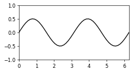

# gif.py

## Description

`gif` contains a class `Gif` that simply stores a list of images, which can at any time be exported as a gif file. It uses imageio to read and write to image/gif files.

## Example

In this example, I plot a periodic travelling wave.

```python
import numpy as np
import matplotlib.pyplot as plt

import gif

def plot_wave(period, amplitude, phase):
    x = np.linspace(0, 2*np.pi)
    y = amplitude * np.sin(2*np.pi/period * (x - phase))

    plt.figure(figsize=(4,2), dpi=60)
    plt.plot(x, y, 'k-')
    plt.box("on")
    plt.xlim([0, 2*np.pi])
    plt.ylim([-1, 1])


# Create a gif
gif = gif.Gif()

phis = np.arange(0, np.pi, np.pi/30)
for phi in phis:
    plot_wave(period = np.pi, amplitude = 0.5, phase = phi)
    # Add current figure as frame to gif
    gif.add_frame()
    plt.close()

# Export the gif
gif.export("wave.gif", fps=30)

```

This produces the following animation:


