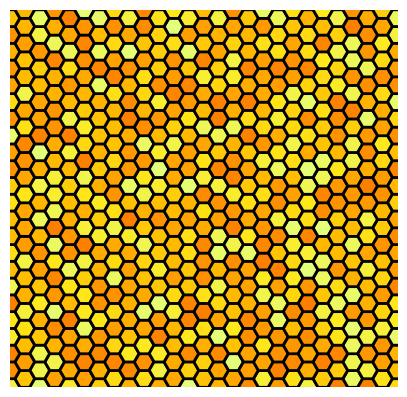

# hexgrid.py

## Description

This module shifts every other column a numpy meshgrid up slightly. There

`x, y = hexgrid.hexgrid(xlim, ylim, ynum)` returns arrays of x- and y-coordinates of hexagon centers.  
Spans ylim exactly, might go over xlim. ynum is the number of hexagons to stack vertically.  


`hexgrid.hexplot(x, y, c, s = 100, edgecolors="black", linewidths = 2, **kwargs)` plots the hex plot (hexagons at `x`, `y` points and color `c`) with a call to `plt.scatter()`. I couldn't figure out a good way to automatically size the hexagons, so do that manually by changing the `s` parameter. Edge color and thickness can also be edited with additional arguments.  

Any arguments to `plt.scatter()` also work for hexplot, e.g. `cmap`.


## Example

This example plots random yellow-orange colors in a hex grid to mimic a honeycomb pattern.

```python
import numpy as np
import matplotlib.pyplot as plt
import hexgrid

# Generate hex grid
lims = [0,1]
num_y = 24
x, y = hexgrid.hexgrid(lims, lims, num_y) # hexgrid
c = np.random.rand(np.size(x))

# Create a plot
plt.figure(figsize=(5,5),dpi=100)
hexgrid.hexplot(x, y, c, s=200, cmap="Wistia") # hexplot
plt.xlim(lims)
plt.ylim(lims)
plt.axis("off")
plt.savefig("honeycomb.png", bbox_inches="tight")
plt.close()
```

This produces the following figure:

