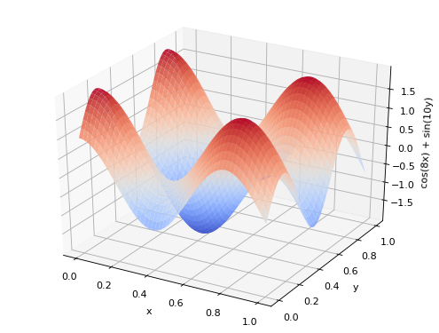

# plot3d.py

## Description

This makes 3D plotting marginally more accessible. It uses `Axes3D` from `mpl_toolkits.mplot3d`. Currently separate 3D subplots on one figure will have to be made manually. Standard `matplotlib.pyplot` commands will work on these figures.

To make a 3D figure, use `plot3d.figure()`.   
Then, plot a surface with `plot3d.surf(x, y, z)` or a point cloud with `plot3d.scatter(x, y, z)`.   
Change axis labels with `plot3d.xlabel()`, `plot3d.ylabel()`, and `plot3d.zlabel()`.   
Set axis limits with `plot3d.xlim()`, `plot3d.ylim()`, and `plot3d.zlim()`. Also set all three axes to have the same range with `plot3d.axis_equal()`.

Note that the default axes may not be positioned perfectly, so `matplotlib.pyplot.subplots_adjust` can help.


## Example

This example plots a 3D surface.

```python
import numpy as np
import matplotlib.pyplot as plt
import plot3d

vals = np.linspace(0, 1, 100)
x, y = np.meshgrid(vals, vals)
z = np.cos(8*x) + np.sin(10*y)

# Create a 3D figure
plot3d.figure(figsize=(6,4.5), dpi=80)
plt.subplots_adjust(left=0, right=1, bottom=0, top=1)

# Make a surface plot
plot3d.surf(x, y, z)

# Change axis names
plot3d.xlabel("x")
plot3d.ylabel("y")
plot3d.zlabel("cos(8x) + sin(10y)")

plt.savefig("surface.png", bbox_inches="tight")
plt.close()
```

This produces the following figure:

