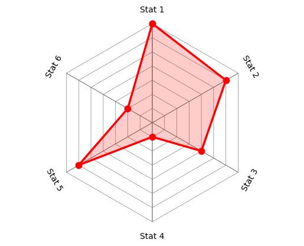

# radar.py

## Description

`radar` contains functions that can facilitate making radar charts (AKA star chart, spider web chart, etc.) in Matplotlib.
The functions are:
- `  plot_polar()`: Plot (filled or non-filled) polar data
- ` theta_space()`: Obtain evenly-spaced angle values
- `    plot_web()`: Plot background radar chart gridlines
- `   plot_star()`: Plot radar chart data
- `polar_labels()`: Place text labels along angle values

## Example

In this example, I plot a radar chart for 6 different stats.

```python
import numpy as np
import matplotlib.pyplot as plt

import radar

rmax = 8
r_ticks = np.arange(1, rmax, 1)
r_vals = [7, 6, 4, 1, 6, 2]
labels = [f"Stat {1 + n}" for n in range(len(r_vals))]

plt.figure()

radar.plot_web(r_ticks, len(r_vals))   # Plot background "web" gridlines
radar.plot_star(r_vals)                # Plot "star" data
radar.polar_labels(labels, rmax)       # Add category labels at angles

plt.axis("equal")
plt.axis("off")
plt.savefig("star.png", bbox_inches="tight")
plt.close()

```

This produces the following image:


