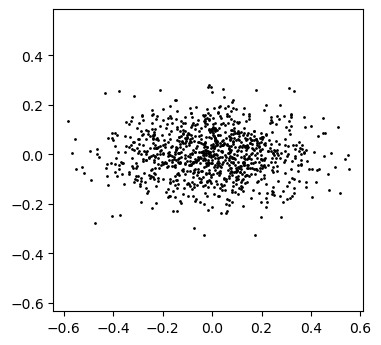

# sampling.py

## Description
The function `sampling.rejection_sample()` performs [rejection sampling](https://en.wikipedia.org/wiki/Rejection_sampling) on a given multivariate distribution. It generates `N` points sampled from the probability density function `pdf`. Reasonable bounds should also be specified, as well as a maximum PDF value within the bounds, if possible. The distribution function does not need to be normalized.


## Example
This example defines a 2D Gaussian function, draws 1000 samples from it, and plots them.
```python
import numpy as np
import matplotlib.pyplot as plt
from sampling import rejection_sample

def gaussian2d(A, mx, my, sx, sy):
    F = lambda xy: A*np.exp(-((xy[:,0]-mx)**2/(2*sx*sx)
                            + (xy[:,1]-my)**2/(2*sy*sy)))
    return F

N = 1000
maxval = 1.0
pdf = gaussian2d(A=maxval, mx=0.0, my=0.0, sx=0.2, sy=0.1)
lbs = [-1.0, -1.0]
ubs = [ 1.0,  1.0]

xy = rejection_sample(pdf, N, lbs, ubs, pdf_max = maxval)

plt.figure(figsize=(4,4), dpi=100)
plt.scatter(xy[:,0], xy[:,1], c="black", s=1)
plt.axis("equal")
plt.savefig("gaussian_2d_samples.png", bbox_inches="tight")
plt.close()
```

This produces the following image:


